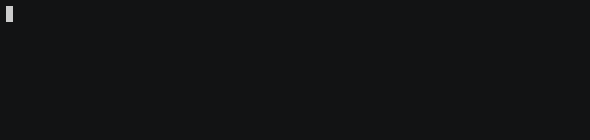

# progressbar

> deno progress bars for the terminal



## Usage

```typescript
import ProgressBar from "https://deno.land/x/progressbar@v0.2.0/progressbar.ts";
import {
  percentageWidget,
  amountWidget,
} from "https://deno.land/x/progressbar@v0.2.0/widgets.ts";

const sleep = (ms: number) => new Promise((resolve) => setTimeout(resolve, ms));

const widgets = [percentageWidget, amountWidget];
const pb = new ProgressBar({ total: 200, widgets });

for (let i = 0; i < pb.total; i++) {
  await pb.update(i);
  await sleep(50);
}
await pb.finish();
```

You can also create widgets yourself, they are just a function which, given the total and current value, returns a string.

```typescript
const percentWidget = (i, total) => `${(i / total * 100)%`;
```

## License

MIT © [Jakob Hellermann](mailto:jakob.hellermann@protonmail.com)
